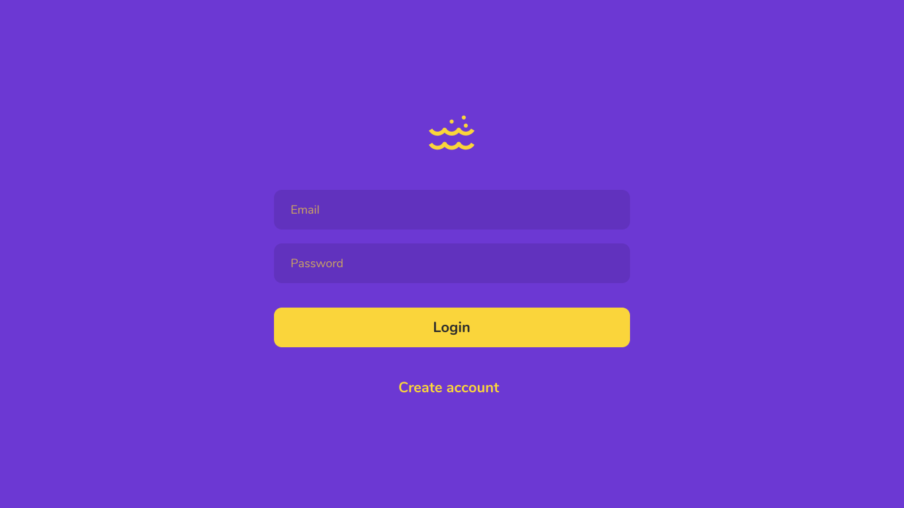
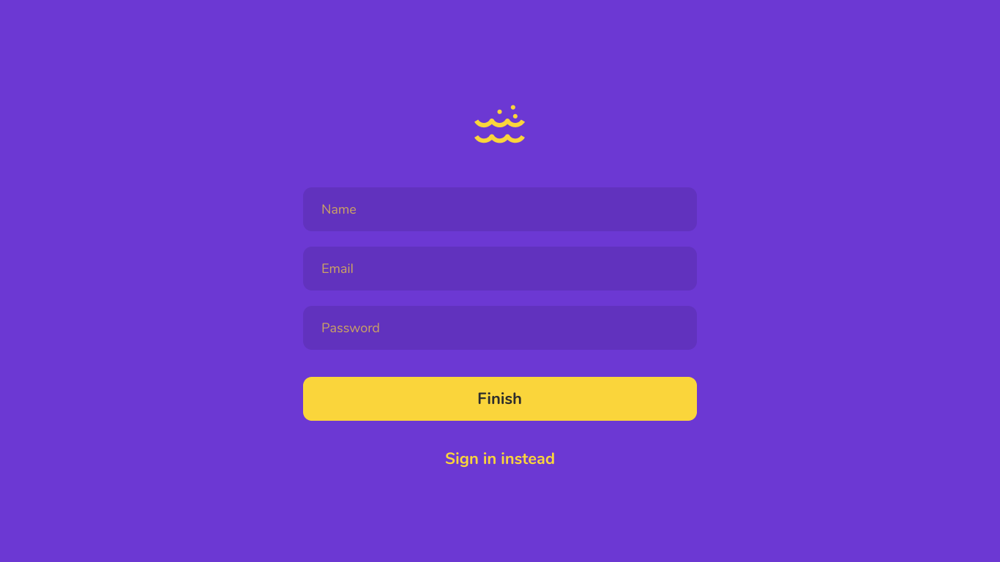
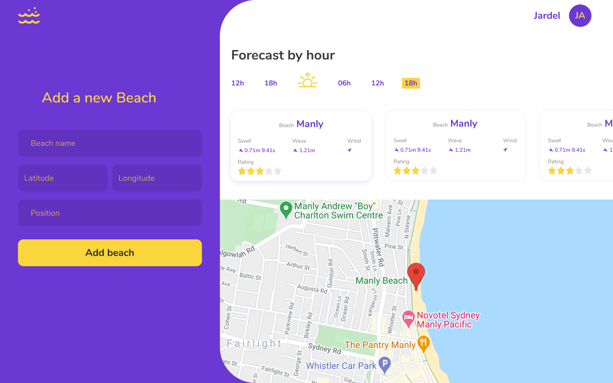

# Finding Wave

Project created during the course from zero to production: learn how to build a Node.js API with Typescript presented by [Waldemar Neto](https://github.com/waldemarnt)

## Screenshot

  
  

  
  

  

