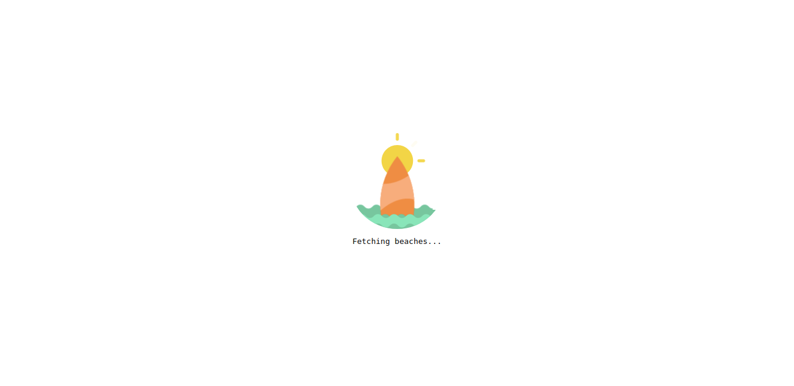
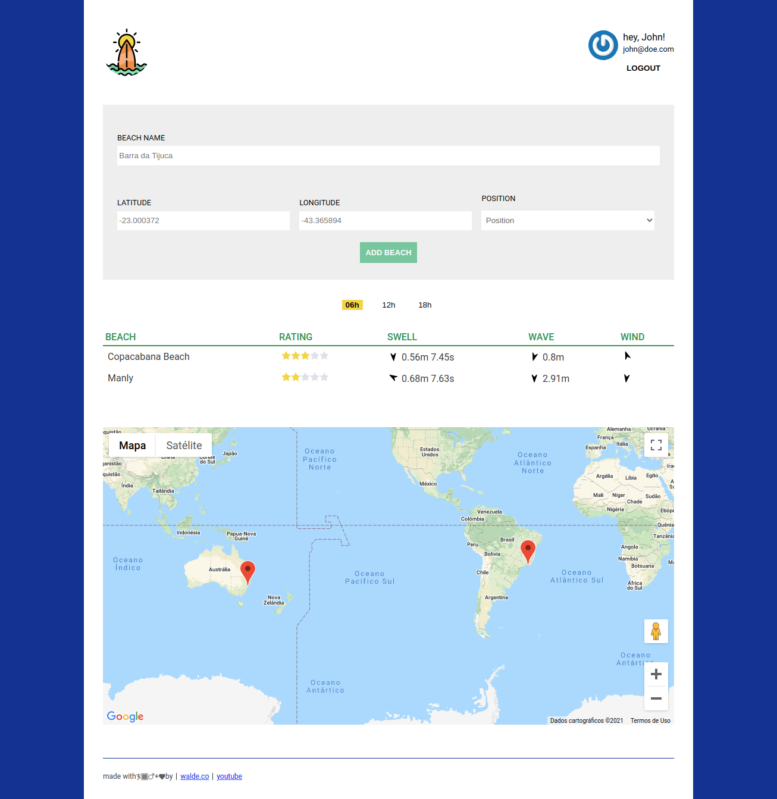

# Finding Wave

Project created during the course from zero to production: learn how to build a Node.js API with Typescript presented by [Waldemar Neto](https://github.com/waldemarnt)

[](https://github.com/jardelgoncalves/finding-waves/actions)

## Screenshot

<div align="center">
  
  <hr />
  
</div>

## Run project
- Backend
  run command:
  ```
  npm i && npm run start:dev
  ```

- Frontend
  Add the URL of the API (for example: `http://localhost:3000`) and add the Google Maps token in `webapp/src/config.js` file

  And then run the command
  ```
  npm i && npm run start
  ```
